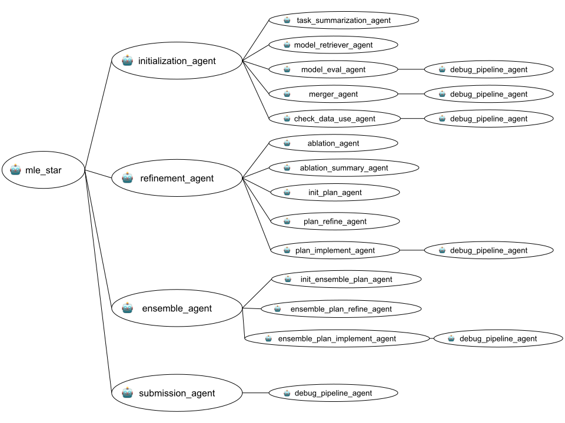

# MLE-STAR — Improved (skrub DataOps edition)

A fork of MLE-STAR (Google ADK sample [`python/agents/machine-learning-engineering`](https://github.com/google/adk-samples), Apache-2.0) that makes the multi-agent ML engineer **skrub DataOps-native**, adds a **TableReport-driven** refinement profile, a dedicated **tuning stage**, and a set of **drift/robustness guards** — plus a runtime-compatibility layer so it runs on OpenAI-compatible providers (OpenAI, ChatAI/SAIA via LiteLLM), not just Gemini.

> The lower half of this README is the original upstream documentation. The top half is our project: what we changed, how to set it up, run it, and evaluate it.

---

## What we changed (our contributions)

**Goal:** steer the agent to produce *structured, reproducible, leakage-safe* pipelines built on [skrub](https://skrub-data.org/) DataOps (instead of ad-hoc sklearn scripts), while keeping the run efficient and robust across LLM providers.

**Novelties**
- **skrub DataOps skill** — an on-demand ADK skill (`SKILL.md` + 14 references) every code-writing agent can load, so generated code uses `skrub.var`/`.skb.apply` DataOps graphs. No prompt bloat.
- **TableReport profiling** — `skrub.TableReport` injected into the refinement/ablation planner agents as a compact dataset profile to support targeted refinement.
- **Tuning stage** — a new terminal stage (`sub_agents/tuning/`) that runs an in-graph `choose_*` randomized search if ablation signal proves tuning is valuable, bakes the best params, and promotes **only if it beats** the structural winner.

**Improvements**
- **Backbone-drift guards & debug contracts** — deterministic code pre-execution checks to stop agents from silently swapping the model family or dropping DataOps blocks to make an error disappear, guarding against LLM randomness while preserving exploration.
- **Execution-robustness gates** — never score empty/tool-call-only turns to enable agent skill usage; compile-check before running for efficiency; truncate huge stdout from verbose estimators; defensive score parsing to avoid unnessary crashing.
- **Deferred submission export** — early stages stop at the holdout metric; full-train refit + `test_df` predict + `submission.csv` are deferred to the submission agent (efficiency).
- **OpenAI/ChatAI runtime compatibility** — model-aware web search (DuckDuckGo for non-Gemini), GPT-5 temperature guard, and response parsing fixes for OpenAI-compatible providers.

Full breakdown with per-file/line pointers and authorship: **[CONTRIBUTIONS.md](CONTRIBUTIONS.md)**.

---

## Quick start

### Prerequisites
- **Python 3.12+**
- **[uv](https://docs.astral.sh/uv/)** — `curl -LsSf https://astral.sh/uv/install.sh | sh`
- **Git**
- An **API key**: an OpenAI-compatible endpoint (OpenAI or ChatAI/SAIA) **or** a Gemini/Vertex key.

### Setup
```bash
# 1. Clone
git clone <fork-url> mle-star-skrub
cd mle-star-skrub/mle-star_improved/agents/machine-learning-engineering

# 2. Configure credentials + model
cp .env.example .env
#   edit .env: set OPENAI_API_KEY, OPENAI_API_BASE, and ROOT_AGENT_MODEL
#   e.g. ROOT_AGENT_MODEL='openai/gpt-5.4-mini'  (Gemini also supported)

# 3. Install dependencies (creates the venv)
uv sync
```

Agent behaviour (task, loop counts, tuning/TableReport toggles) lives in
[`machine_learning_engineering/shared_libraries/config.py`](agents/machine-learning-engineering/machine_learning_engineering/shared_libraries/config.py) — set `task_name`/`task_type`/`lower` for the task you want, or add a task pack under `machine_learning_engineering/tasks/<name>/` (with `train.csv`, `test.csv`, `task_description.txt`).

### Run the agent
From `agents/machine-learning-engineering`:
```bash
# CLI
uv run adk run machine_learning_engineering

# Web UI (prints a local URL; pick `machine_learning_engineering` in the dropdown)
uv run adk web
```

### Run the automated experiments
From the improved checkout root (`mle-star_improved/`):
```bash
# 0. Build the task manifest
python automated_evaluation/generate_tasks_manifest.py

# 1. Execute the run matrix (tasks × {improved, vanilla}), archived under runs/<stamp>/
python automated_evaluation/run_experiments.py \
  --runs-root automated_evaluation/runs/<stamp> --skip-existing

# 2. Analyze → writes eval_results/<stamp>/report.md
python automated_evaluation/evaluate.py --summarize-only \
  --runs-root automated_evaluation/runs/<stamp>
```
Full guide (multi-model/repeat runs, `.env` shell loading, artifact layout): **[EXPERIMENTS.md](EXPERIMENTS.md)**.

---

## Documentation map

| File | What's in it |
|------|--------------|
| **[CONTRIBUTIONS.md](CONTRIBUTIONS.md)** | What we built vs upstream/vanilla, grouped by intent, with clickable file/line pointers and authorship. |
| **[EXPERIMENTS.md](EXPERIMENTS.md)** | Exact scripts and commands to run/reproduce the benchmark, plus where the result artifacts live and how to extend to new models/repeats. |
| **[EXPERIMENTAL_RESULTS.md](EXPERIMENTAL_RESULTS.md)** | Discussion of the results (primary + efficiency metrics), stage-promotion analysis, and how outcomes connect back to our modifications. |
| [docs/](docs/) | Deeper design notes (`WORKING_PROGRESS_MLE_STAR_SKRUB.md`, `BACKBONE_DRIFT_GUARDS.md`, `MLE_STAR_AGENT_EXPLAINED.md`). |

## Main code components

```
agents/machine-learning-engineering/machine_learning_engineering/
├── agent.py                 # root pipeline: init → refine → [tune] → ensemble → submission
├── shared_libraries/        # config (flags for novelty-enable), code exec/guards, skill+search tooling, TableReport, debug/leakage utils
├── sub_agents/
│   ├── initialization/      # retrieve models, generate + merge initial solutions
│   ├── refinement/          # ablation + targeted block refinement (+ TableReport profile)
│   ├── tuning/              # NEW: terminal choose_* search → bake → gated promotion
│   ├── ensemble/            # propose + refine ensemble strategies
│   └── submission/          # full-train refit + test predict + submission.csv export
├── skills/skrub-dataops-pipeline/   # the on-demand DataOps skill (SKILL.md + references/)
└── tasks/                   # benchmark task packs
automated_evaluation/        # run_experiments.py, evaluate.py, generate_tasks_manifest.py, runs/, eval_results/
```

## Results at a glance

_Single batch: `openai/gpt-5.4-mini`, 10 tasks × {improved, vanilla}, seed 42, N=1 per cell. Directional, not statistically significant — this section will be expanded. See [EXPERIMENTAL_RESULTS.md](EXPERIMENTAL_RESULTS.md)._

- **Structural goal met:** DataOps adherence **0.82–0.94** for skrub-full vs **0.0** for vanilla.
- **Primary metric (fair "best" score):** vanilla ahead on **7/10** tasks with this single model/seed, but skrub-full's wins are large (bike-sharing ~95% lower error, restaurant-revenue ~37% lower) while its losses are mostly tiny (2/7 vanilla wins can be seen as tie).
- **Efficiency:** skrub-full runs **leaner per script (8/10)** and is **faster end-to-end on the most expensive tasks (4/10)**; extra wall time appears only when skill loading (i.e. due to debugging effort) / tuning fire heavily.
- **Tuning stage** triggered in 1/10 tasks and, guarded, correctly did not promote a worse result. The tuning plan agent is designed to decide wether tu skip tuning themselves from the ablation/refinement signal, which often already achieves most gains to be made.

---
---

# Upstream documentation (MLE-STAR)

The Machine Learning Engineering Agent is an approach to building Machine Learning Engineering (MLE) agents that can train state-of-the-art machine learning models on various tasks (including classification and regression tasks), through a novel approach of leveraging web search and targeted code block refinement. Using the example of predicting California housing prices, we show how MLE-STAR can create a regression model based on factors like population, income, etc. that outperforms traditional approaches to training ML models. The experimental results show that MLE-STAR achieves medals in 63.6% of the Kaggle competitions on the MLE-bench-Lite, significantly outperforming the best alternative. The implementation is based on the Google Cloud AI Research paper "MLE-STAR: Machine Learning Engineering Agent via Search and Targeted Refinement" (https://www.arxiv.org/abs/2506.15692).

#### Performance of MLE agents on [MLE-Bench-Lite](https://github.com/openai/mle-bench/tree/main) datasets.

| MLE Agents | Base LLM | Any Medals| Gold Medals | Silver Medals | Bronze Medals |
| --- | --- | --- | --- | --- | --- |
| [ **MLE-STAR** ](https://www.arxiv.org/pdf/2506.15692) | **Gemini-2.5-Pro** | **63.6%** | **36.4%** | **21.2%** | 6.1% |
| [ **MLE-STAR** ](https://www.arxiv.org/pdf/2506.15692) | **Gemini-2.5-Flash** | 43.9% | 30.3% | 4.5% | **9.1%** |

<br>

## Agent Details

The key features of the Machine Learning Agent include:

| Feature | Description |
| --- | --- |
| **Interaction Type** | Conversational |
| **Complexity**  | Advanced |
| **Agent Type**  | Multi Agent |
| **Components**  | Tools: Code execution, Retrieval |
| **Vertical**  | All |

### Agent architecture

This diagram shows the detailed architecture of the agents and tools used
to implement this workflow.


### Key Features

1. **Initial Solution Generation:** Uses a search engine to retrieve state-of-the-art models and their example codes, then merges the best-performing candidates into a consolidated initial solution.

2. **Code Block Refinement:** Iteratively improves the solution by identifying and targeting specific code blocks (ML pipeline components) that have the most significant impact on performance, determined through ablation studies. An inner loop refines the targeted block with various strategies.

3. **Ensemble Strategies:** Introduces a novel ensembling method where the Agent proposes and refines ensemble strategies to combine multiple solutions, aiming for superior performance than individual best solutions.

4. **Robustness Modules:** Includes a debugging agent for error correction, a data leakage checker to prevent improper data access during preprocessing, and a data usage checker to ensure all provided data sources are utilized.

### Example Interaction

You may open the URL, select "machine_learning_engineering" in the top-left drop-down menu, and
a chatbot interface will appear on the right. The conversation is initially
blank. Here are some example requests you may ask the Machine Learning Agent to identity itself:

> **[user]:** who are you?

> **[mle_frontdoor_agent]:** I am a machine learning engineer agent.

> **[user]:** what can you do?

> **[mle_frontdoor_agent]:** I am a machine learning engineer. My primary role is to engineer solutions for machine learning tasks, such as the California Housing Task. I can also describe the task if you'd like. I work by executing a sequence of sub-agents to solve the machine learning engineering task.

> **[user]:** describe the task that you have

> **[mle_frontdoor_agent]:** The task I have is the California Housing Task. This task involves predicting the median house value in California districts, given various features about those districts. It's a regression problem where the goal is to build a model that can accurately estimate house prices based on factors like population, median income, and housing age within a district.

> **[user]:** execute the task

> **[mle_frontdoor_agent]:** *intermediate output snipped*.

### Development & tests

```bash
uv sync --dev
uv run pytest tests
```

### Deployment (upstream, Vertex AI Agent Engine)

The upstream project supports deployment to Vertex AI Agent Engine and scaffolding via the [Agent Starter Pack](https://goo.gle/agent-starter-pack). This requires a Google Cloud account/project and `GOOGLE_CLOUD_BUCKET`:

```bash
uv sync --group deployment
uv run deployment/deploy.py --create      # deploy
uv run deployment/deploy.py --list        # list deployed agents
uv run deployment/deploy.py --delete --resource_id=${AGENT_ENGINE_ID}
```

This fork is developed/run locally against OpenAI-compatible providers, so the Google Cloud deployment path is optional.

## Appendix — key `config.py` parameters

Configuration lives in the `DefaultConfig` dataclass in [`shared_libraries/config.py`](agents/machine-learning-engineering/machine_learning_engineering/shared_libraries/config.py).

| Parameter | Type | Default | Description |
|-----------|------|---------|-------------|
| `data_dir` | `str` | `"./machine_learning_engineering/tasks/"` | Where task packs and their data live. |
| `task_name` | `str` | task-specific | The task to load and process. |
| `task_type` | `str` | e.g. `"Tabular Regression"` | Problem type. |
| `lower` | `bool` | `True` | `True` if a lower metric value is better. |
| `workspace_dir` | `str` | `"./machine_learning_engineering/workspace/"` | Intermediate outputs, logs, artifacts. |
| `agent_model` | `str` | `os.environ["ROOT_AGENT_MODEL"]` or `"gemini-2.0-flash-001"` | LLM used by all agents. |
| `num_solutions` | `int` | `1` | Parallel solution legs. |
| `num_model_candidates` | `int` | `2` | Candidate models in init retrieval. |
| `inner_loop_round` / `outer_loop_round` / `ensemble_loop_round` | `int` | `1` | Refinement/ensemble loop counts. |
| `max_debug_round` / `max_rollback_round` | `int` | `5` / `2` | Debug retries / rollbacks. |
| `exec_timeout` | `int` | `600` | Per-script execution cap (s). |
| `table_report_enabled` | `bool` | `True` | **(ours)** Build TableReport profile for refinement. |
| `tuning_enabled` / `tuning_n_iter` | `bool` / `int` | `True` / `5` | **(ours)** Terminal tuning stage + search iterations. |

---

_Derived from google/adk-samples (`python/agents/machine-learning-engineering`), Apache-2.0. Paper: [MLE-STAR: Machine Learning Engineering Agent via Search and Targeted Refinement](https://www.arxiv.org/abs/2506.15692)._
