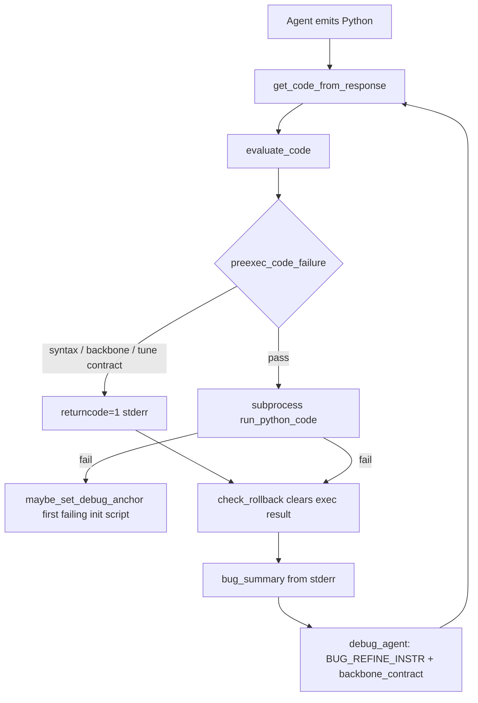

# Backbone drift guards

This document describes every guard added to stop **backbone drift**: debug or implement agents swapping model families (e.g. CatBoost → LogisticRegression / RandomForest) to silence errors instead of fixing the pipeline in place.

**Short answer on debug agents:** init and tune debug are **prompt + strict pre-exec** (set equality). Refinement debug is **prompt-only**. Ablation debug gets **print + baseline overlap pre-exec**. Promotion in refinement is **score-only**.

---

## Pre-exec at a glance

All gates run in `preexec_code_failure()` before subprocess (`evaluate_code()`). Order: **compile → backbone (if enforced) → tune search (if tune) → ablation print (if ablation)**.

| Agent prefix | Pre-exec check | Anchor (for backbone / context) | Too strict? |
|--------------|----------------|-----------------------------------|-------------|
| `model_eval*` (+ debug) | Estimator **set equality** | Primary: `init_{task_id}_model_{model_id}` → parse retriever `model_name`. Fallback: `debug_anchor_code_{suffix}` (first failing init script). | Skipped if anchor parses empty (regex gap). Set equality blocks any extra/missing class vs anchor — intentional for init. |
| `tune_implement*` (+ debug) | Set equality **+** tune search strings | `train_code_{outer_loop_round}_{task_id}` (final promoted structural script before tuning) | Search contract requires all of `choose_*`, `make_randomized_search`, `search.fit`, `TUNING_BEST_PARAMS` — blocks “fix” scripts that drop search; intentional. Multi-estimator structural scripts require **all** classes preserved. |
| `ablation*` (+ debug) | `"Ablation["` in source **+ ≥1 input estimator overlap** | `train_code_{refine_step}_{task_id}` | Overlap only (not set equality); extra variant models OK if baseline keeps input class. |
| `plan_implement*` | None | Prompt-only: `train_code_{refine_step}_{task_id}` in `# Backbone contract` | Implement may swap backbone if plan says so. |
| `tune_bake*`, `merger*`, `ensemble_*`, `submission*` | None | — | — |

**Not pre-exec:** refinement implement/plan (prompt only), merger, ensemble, bake, submission.

---

## Two enforcement modes

| Mode | What it does | Where |
|------|----------------|-------|
| **Hard pre-exec gate** | Before subprocess: compile → optional backbone set-equality → optional tune-search contract. Violations get `returncode=1` and explicit `stderr`; code never runs. | `code_util.preexec_code_failure()` via `evaluate_code()` |
| **Prompt contract** | Injects `# Backbone contract` and inline “do not swap backbone” rules into agent instructions. LLM may still violate; no automatic reject unless a hard gate applies. | `debug_util._get_backbone_contract()`, `debug_prompt.py`, refinement/tuning prompts |

---

## End-to-end flow (init / tune debug)



1. **`evaluate_code()`** always calls **`preexec_code_failure()`** first when code is non-empty (`code_util.py` ~684–688).
2. On **`returncode != 0`**, **`check_rollback()`** clears the execution result state so failed/drifted runs are not treated as successes (`debug_util.py` ~22–42).
3. The debug loop summarizes **`stderr`** (including `Backbone drift: ...`) and re-injects a **stable** `# Backbone contract` from anchors — not from the current buggy code.

---

## Hard pre-exec gates (`code_util.py`)

### `should_enforce_backbone_drift(agent_name)`

```32:34:mle-star_improved/agents/machine-learning-engineering/machine_learning_engineering/shared_libraries/code_util.py
def should_enforce_backbone_drift(agent_name: str) -> bool:
    """Stages where debug must not swap the backbone estimator set."""
    return agent_name.startswith("model_eval") or agent_name.startswith("tune_implement")   # can add more here if needed to enable preexec code checks
```

**Enforced:** any agent whose name starts with `model_eval*` or `tune_implement*`.

That includes **debug agents** (`model_eval_debug_agent_*`, `tune_implement_debug_agent_*`) because their names share those prefixes. Tests confirm this:

```105:112:mle-star_improved/agents/machine-learning-engineering/tests/test_code_util.py
def test_should_enforce_backbone_drift_init_and_tune_only():
    assert code_util.should_enforce_backbone_drift("model_eval_agent_1_1")
    assert code_util.should_enforce_backbone_drift(
        "model_eval_debug_agent_1_1"
    )
    assert code_util.should_enforce_backbone_drift("tune_implement_agent_1")
    assert not code_util.should_enforce_backbone_drift("plan_implement_agent_1")
    assert not code_util.should_enforce_backbone_drift("merger_agent_1_1")
```

**Not enforced (backbone):** `plan_implement*` (including `plan_implement_initial*`), `merger*`, `ensemble_*`, `ablation*`, `tune_bake*`, `submission*`.

### Estimator detection — `_ESTIMATOR_CLASS_RE` / canonical aliases

Regex matches `*Classifier`/`*Regressor` plus common sklearn names. Before set-equality, **`canonical_estimator_set()`** maps known alias pairs to one name (e.g. `LightGBMClassifier` → `LGBMClassifier`, `XGBoostClassifier` → `XGBClassifier`). This avoids false drift when the retriever uses a marketing name but code imports the real symbol, or when `import LGBMClassifier as LightGBMClassifier` leaves both strings in source.

Drift is **canonical set equality** on matched class names:

```86:103:mle-star_improved/agents/machine-learning-engineering/machine_learning_engineering/shared_libraries/code_util.py
def backbone_drift_violation(
    required: set[str],
    candidate_code: str,
    *,
    label: str,
) -> str | None:
    """Return an error if candidate code uses a different estimator set."""
    if not required:
        return None
    candidate = _estimator_classes(candidate_code)
    if candidate == required:
        return None
    return (
        "Backbone drift: keep estimator classes "
        f"{sorted(required)} ({label}); got {sorted(candidate)}. "
        "Fix the reported error without swapping model families or "
        "simplifying to a different pipeline."
    )
```

If **`required` is empty** (unparsable retriever, no anchor, no structural code), the backbone check is **skipped** — no false reject, but also no protection.

### Stable anchors — `resolve_backbone_required()`

Required estimator set is resolved from **pipeline state**, never from the current failing script (except init fallback below):

| Agent prefix | Anchor source | State key / label |
|--------------|---------------|-------------------|
| `model_eval*` | Model retriever output | `init_{task_id}_model_{model_id}` → parse `model_name` (`retriever: …`) |
| `model_eval*` (fallback) | First failing init script | `debug_anchor_code_{suffix}` (`first failing init script`) |
| `tune_implement*` | Promoted structural solution | `train_code_{outer_loop_round}_{task_id}` (`structural solution`) |
| `plan_implement*` | Structural code at refine step | `train_code_{refine_step}_{task_id}` (prompt / future use) |
| `ablation*` | Same input script (not used in pre-exec) | `train_code_{refine_step}_{task_id}` (`input solution at refine step N`) |

```41:83:mle-star_improved/agents/machine-learning-engineering/machine_learning_engineering/shared_libraries/code_util.py
def resolve_backbone_required(
    callback_context: callback_context_module.CallbackContext,
    agent_name: str,
    suffix: str,
) -> tuple[set[str], str]:
    """Return (required_estimator_classes, short_label) for backbone drift checks."""
    if agent_name.startswith("model_eval"):
        ...
    if agent_name.startswith("tune_implement"):
        ...
    if agent_name.startswith("plan_implement"):
        ...
    return set(), ""
```

**Init fallback anchor** — `maybe_set_debug_anchor()` snapshots the first failing script when subprocess fails, only for enforced stages and non-debug implement agents:

```126:137:mle-star_improved/agents/machine-learning-engineering/machine_learning_engineering/shared_libraries/code_util.py
def maybe_set_debug_anchor(
    ...
) -> None:
    """Snapshot the first failing script for init fallback anchoring."""
    if "debug_agent" in agent_name or not should_enforce_backbone_drift(agent_name):
        return
    key = debug_anchor_code_key(suffix)
    if not callback_context.state.get(key) and code.strip():
        callback_context.state[key] = code
```

### `preexec_code_failure()` — full gate order

```140:179:mle-star_improved/agents/machine-learning-engineering/machine_learning_engineering/shared_libraries/code_util.py
def preexec_code_failure(...) -> dict[str, Any] | None:
    """Compile + backbone/search gates before subprocess (cheap, explicit stderr)."""
    ...
    if should_enforce_backbone_drift(agent_name):
        required, label = resolve_backbone_required(...)
        drift = backbone_drift_violation(required, raw_code, label=label)
        if drift:
            return {"returncode": 1, "stdout": "", "stderr": drift, ...}
    if agent_name.startswith("tune_implement"):
        contract = tune_search_contract_violation(raw_code)
        ...
    if agent_name.startswith("ablation"):
        contract = ablation_contract_violation(raw_code)
        ...
    return None
```

### Tune search contract (not backbone, but same pre-exec path)

Only on `tune_implement*`. Requires in-graph search artifacts:

- `choose_*`
- `make_randomized_search`
- `search.fit`
- `TUNING_BEST_PARAMS` print

See `tune_search_contract_violation()` in `code_util.py` ~106–123. Tuning **implement** prompts in `sub_agents/tuning/prompt.py` reinforce preserving structural FE and backbone; the runtime gate is the contract above plus backbone set-equality against `train_code_{outer_loop_round}_{task_id}`.

---

## Debug prompt guards (`debug_util.py`, `debug_prompt.py`)

### Static instruction — `BUG_REFINE_INSTR`

```28:28:mle-star_improved/agents/machine-learning-engineering/machine_learning_engineering/shared_libraries/debug_prompt.py
- Follow `# Backbone contract` when present: fix the error in place without swapping model family or dropping `.skb.apply_func` / encoder blocks, unless the bug is truly unfixable without that change.
```

The `{backbone_contract}` block is appended below requirements; `{task_description}` comes from pipeline state (`task_description` key loaded from `tasks/<task>/task_description.txt` at run start).

### Dynamic contract — `_get_backbone_contract()`

```159:193:mle-star_improved/agents/machine-learning-engineering/machine_learning_engineering/shared_libraries/debug_util.py
def _get_backbone_contract(...) -> str:
    """Deterministic anti-drift context from retriever/structural anchor (for debug agent)."""
    if agent_name.startswith("plan_implement"):
        required, label = code_util.resolve_backbone_required(...)
        if required:
            return "\n# Backbone contract\n- Required estimator classes ({label}): ..."
        return "\n# Backbone contract\n- Preserve the structural solution's model family ..."
    if not code_util.should_enforce_backbone_drift(agent_name):
        return ""
    required, label = code_util.resolve_backbone_required(...)
    ...
```

| Debug agent | Dynamic `# Backbone contract` | Hard pre-exec on debug output |
|-------------|------------------------------|-------------------------------|
| `model_eval_debug_agent_*` | Yes — retriever / init anchor | **Yes** — same as implement |
| `tune_implement_debug_agent_*` | Yes — structural `train_code_{outer}_{task}` | **Yes** — backbone + tune search contract |
| `plan_implement*_debug_agent_*` | Yes — `train_code_{refine_step}_{task}` | **No** — prompt only |
| `ablation*_debug_agent_*` | Input-solution estimators (baseline overlap) | **Yes** — `Ablation[` template + baseline backbone overlap |
| Merger / ensemble / submission debug | No backbone block | **No** |

**Refinement debug** therefore still *sees* required classes in the prompt, but a LogisticRegression swap will **execute** if it passes compile and other run conditions. Observed in Spaceship Titanic runs before/after this split: refinement debug could still attempt family swaps under error pressure; init/tune could not pass pre-exec with a swap.

---

## Refinement implement / plan guards (prompt-only)

No backbone pre-exec on `plan_implement*` implement agents. Guardrails are inline in `sub_agents/refinement/prompt.py`:

- Planner prompts (~132, ~182, ~230): do not swap backbone / `.skb.apply_func` / encoder blocks unless the plan **explicitly** says to change them.
- Implement prompts (~269): same, scoped to the planned code block.
- Prefer FE/preprocessing over model-family swaps when the data profile suggests structural opportunities.

Implement agents merge patches into structural code via `get_code_from_response()` (`debug_util.py` ~247–267); there is no post-merge backbone check.

### Promotion — not a drift guard

`update_outer_loop_states()` in `sub_agents/refinement/agent.py` promotes the best-scoring inner-loop improvement vs the current structural baseline. It does **not** inspect estimator classes:

```49:79:mle-star_improved/agents/machine-learning-engineering/machine_learning_engineering/sub_agents/refinement/agent.py
    for inner_iter in range(1 + inner_loop_round):
        exec_result = callback_context.state.get(
            f"train_code_improve_exec_result_{inner_iter}_{step}_{task_id}",
            {},
        )
        ...
        if best_improvement > 0.0:
            best_solution = callback_context.state.get(
                f"train_code_improve_{best_idx}_{step}_{task_id}", ""
            )
```

Drifted code that runs and scores worse than baseline is not promoted. Drifted code that accidentally scores better **can** be promoted — by design, refinement is allowed to change backbone when the plan/implement path intends it.

---

## Ablation guards

| Layer | Mechanism |
|-------|-----------|
| **Pre-exec (shipped)** | `ablation_contract_violation()` — `Ablation[` print template. `ablation_backbone_violation()` — canonical overlap: script must include **≥1** estimator from input `train_code_{refine_step}_{task}`. Extra variants may add other models. |
| Prompt | Baseline must reuse estimator class(es) from the input Python solution; same split unless model swap is the explicit hypothesis |
| Post-run stdout | After subprocess exit 0: ≥2 `Ablation[` lines in stdout (`code_util.py` ~706–718). Catches scripts with a print template but only one variant at runtime. |
| Debug message on violation | Pre-exec or post-run `stderr` names the contract |

**Input script (context, not pre-exec enforced):** `train_code_{refine_step}_{task_id}` — same code shown to the ablation agent in `get_ablation_agent_instruction()`. No backbone pre-exec by design.

---

## Tuning stage summary

| Agent | Backbone pre-exec | Other pre-exec / runtime |
|-------|-------------------|---------------------------|
| `tune_implement*` (+ debug) | Yes — vs structural `train_code_{outer}_{task}` | Tune search contract |
| `tune_bake*` (+ debug) | No | Placeholder check via `code_contains_tuning_placeholders`; prompts require restoring structural capacity |

Tuning prompts (`sub_agents/tuning/prompt.py`) add soft constraints: no backbone swap in plan, reproduce structural pipeline verbatim in implement/bake.

---

## Init / merger / ensemble

| Stage | Backbone guard |
|-------|----------------|
| `model_eval*` (+ debug) | Hard pre-exec + debug contract + init anchor fallback |
| `merger*` | None |
| `ensemble_plan_implement*` (+ debug) | None |
| `check_data_use*` | None |

---

## Tests

`tests/test_code_util.py` covers:

- `backbone_drift_violation` reject/accept
- `tune_search_contract_violation`
- `ablation_contract_violation` (print template only)
- `should_enforce_backbone_drift` including debug agent names
- `resolve_backbone_required` for `plan_implement*` and `ablation*`

Run: `pytest agents/machine-learning-engineering/tests/test_code_util.py -k backbone -k tune -k enforce -k resolve`

---

## Known gaps

1. **Empty `required` set** — if retriever text and regex both miss estimators, backbone gate is a no-op for that run.
2. **Refinement debug** — prompt-only; no hard reject on family swap.
3. **Promotion** — score-only; no backbone filter.
4. **Ablation variant count** — pre-exec does not count variants; post-run stdout still requires ≥2 `Ablation[` lines.

Related progress notes: [WORKING_PROGRESS_MLE_STAR_SKRUB.md](./WORKING_PROGRESS_MLE_STAR_SKRUB.md) §41–§44.

---

## Proposed improvements (not shipped)

### Refinement debug pre-exec — deferred

**Do not** reuse the current `plan_implement` path in `should_enforce_backbone_drift()` with **structural** `train_code_{step}` as anchor. That would block legitimate fixes when the implement agent already applied a **plan-authorized** backbone swap (debug would be forced back to CatBoost while fixing a LogisticRegression script).

| Approach | Strictness | Plan-authorized swap | Blocks debug drift |
|----------|------------|----------------------|--------------------|
| A. Prompt only (today) | Low | Yes | Weak |
| B. Pre-exec vs **structural** anchor | **Too strict** | **No** — false rejects | Strong |
| C. Pre-exec vs **first-failing script** anchor | Medium | **Yes** — anchor captures implement output | Strong |
| D. Pre-exec on all `plan_implement*` implement + debug | High | Breaks intentional implement edits | Strong |

**Recommendation: C — debug-only, first-failure anchor**

1. New gate: `should_enforce_refinement_debug_drift(agent_name)` → `"debug_agent" in agent_name and agent_name.startswith("plan_implement")`.
2. On first failed run (implement **or** debug) for a given `(refine_step, inner_iter, task_id)`, snapshot estimator set into e.g. `refinement_debug_anchor_{suffix}` (reuse `maybe_set_debug_anchor` pattern with a separate key namespace).
3. Pre-exec on subsequent debug edits: **set-equality** vs that snapshot (same as init/tune).
4. Keep `_get_backbone_contract()` on **structural** anchor for guidance text (“structural solution used CatBoost…”) but stderr from pre-exec references the **first-failure** anchor when enforcing.

Effects:

- Implement agent can still swap backbone per plan (no pre-exec on non-debug `plan_implement*`).
- Once a failing script exists, debug cannot “fix” by swapping to Ridge/RF — matches init/tune debug behavior.
- If the first failure is already on structural CatBoost, debug stays on CatBoost (desired).

**When C is still too strict:** rare cases where the *only* fix is a different estimator (e.g. CatBoost install missing, no pip). Prompt already allows “truly unfixable without class change” — you could add a one-shot escape hatch (e.g. clear anchor after N identical drift failures) but that adds complexity; start without it.

**Do not enforce on ablation / merger / ensemble debug** unless separately designed.

---

### Suggested follow-ups

1. **Refinement debug first-failure anchor** — see table above; do not use structural anchor.
2. Optionally drop ablation post-run check if pre-exec + runs look sufficient (post-run still needed for single-variant scripts that pass pre-exec).
3. Optional: ablation debug `# Backbone contract` in prompt.

---

## File index

| File | Role |
|------|------|
| `shared_libraries/code_util.py` | Regex, anchors, `preexec_code_failure`, `evaluate_code`, ablation stdout contract |
| `shared_libraries/debug_util.py` | Debug loop, `_get_backbone_contract`, `check_rollback`, `get_code_from_response` → `evaluate_code` |
| `shared_libraries/debug_prompt.py` | `BUG_REFINE_INSTR` backbone line + placeholders |
| `sub_agents/refinement/prompt.py` | Planner/implement anti-drift prompt lines |
| `sub_agents/refinement/agent.py` | Score-based promotion (`update_outer_loop_states`) |
| `sub_agents/tuning/prompt.py` | Structural preservation + no backbone swap in tune plan |
| `tests/test_code_util.py` | Unit tests for gates and anchors |
